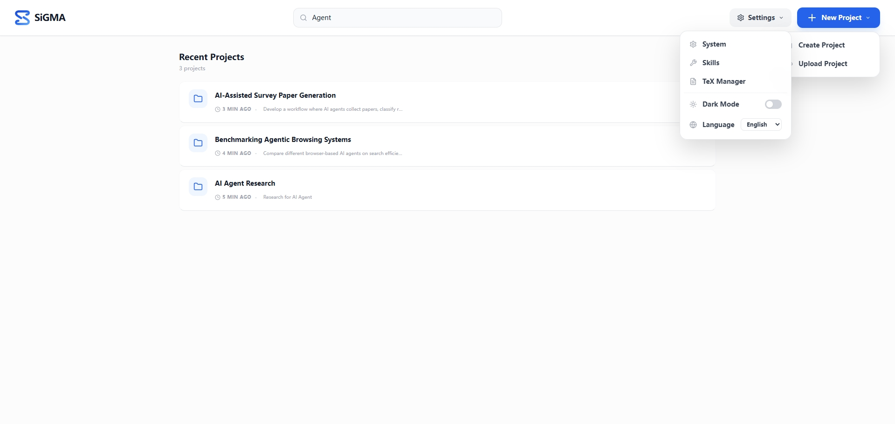
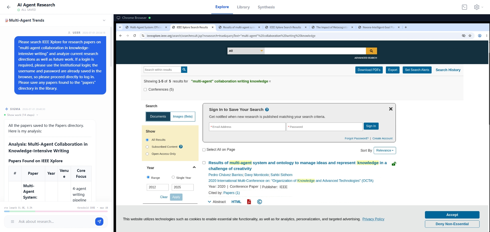
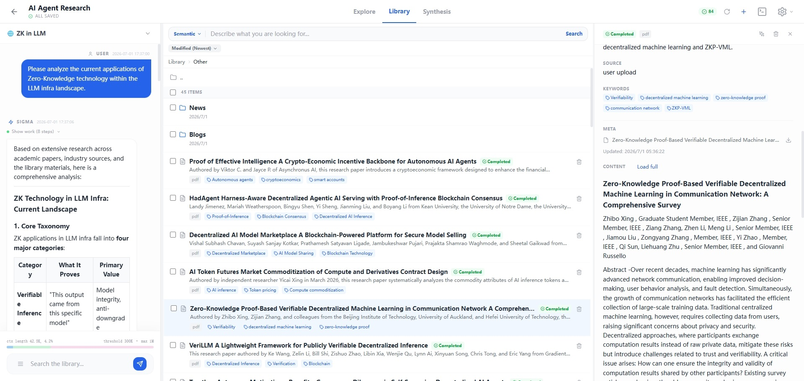
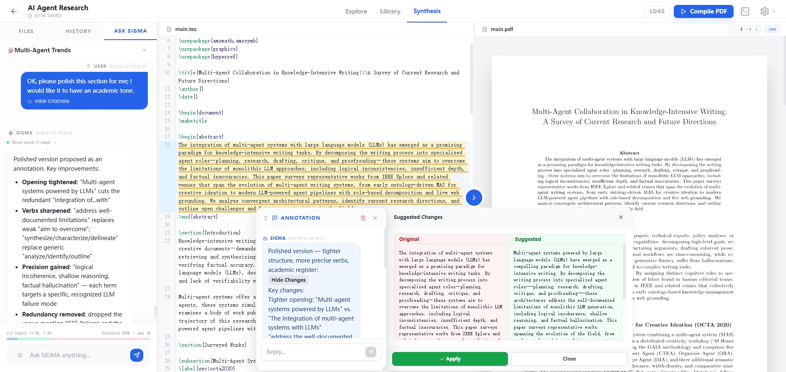
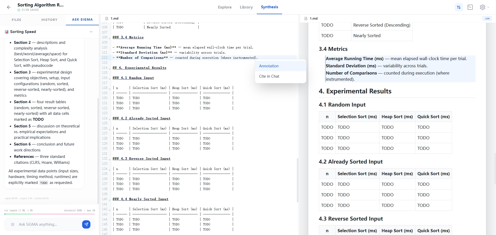
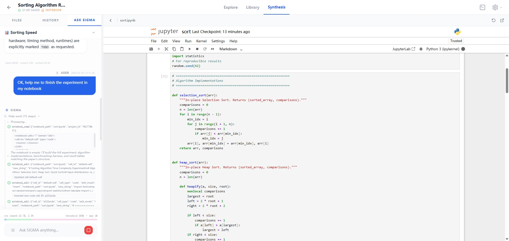

# SiGMA — An AI Workspace for Research, Knowledge, and Writing

> **Si**licon **G**runt **M**ulti-**A**gent. 
> 
> Vibe work for knowledge-intensive projects. 
> 
> **You think, they toil**.

[](LICENSE)
[](backend/app/main.py)
[](frontend/package.json)
[](docker-compose.yml)

SiGMA is a **fully open-source local AI workspace** for research, writing, and
knowledge-intensive projects. It can be deployed privately on your own machine
or server, keeping your data under your control.

## Highlights

- **Local-first workspace**: deploy privately with Docker and keep project data under your control.
- **Supervisable browser agent**: let AI browse through a live Chromium session while you can watch, login, solve CAPTCHA, or take over.
- **Research library**: collect PDFs, Office documents, images, and web findings with OCR, keyword search, semantic retrieval, and optional reranking.
- **Writing and analysis space**: draft Markdown, LaTeX, notebooks, and lightweight code with live preview and AI collaboration.
- **Open agent workflow**: connect your own model providers and extend SiGMA with skills, browser tools, and project import.

And that's only the beginning.

| Home | Explore |
| --- | --- |
|  |  |

| Library | Synthesis - LaTeX |
| --- | --- |
|  |  |

| Synthesis - Markdown | Synthesis - Jupyter Notebook |
| --- | --- |
|  |  |

## Why Not Just Codex, Claude Code, or OpenCode?

SiGMA is built around a broader research-to-writing workflow.

Many knowledge-intensive tasks start with browsing, collecting materials,
reading documents, comparing sources, building context, drafting ideas, running
small analyses, and only sometimes writing code. SiGMA tries to keep that whole
process in one local workspace.

Instead of treating the agent as a command-line coding assistant only, SiGMA
gives it three connected spaces:

- a browser it can use and you can supervise;
- a library where documents and research materials can accumulate;
- a synthesis workspace for writing, notebooks, LaTeX, Markdown, and lightweight implementation.

SiGMA is not meant to replace specialized coding tool. It is meant to
connect research, knowledge management, writing, and implementation so that the
agent can work with more context and you can stay closer to the process.


**SiGMA is early-stage and actively evolving. Expect rough edges, but the 
core workflow is usable and improving quickly.**

---

## Quick Start

SiGMA provides CPU and GPU Docker images. Use the CPU image if your embedding
and rerank models run on CPU, or if you use cloud APIs for those models. Use
the GPU image if you have an NVIDIA GPU, want local models to run on GPU, and
have installed the NVIDIA driver and NVIDIA Container Toolkit.

NOTICE: If Hugging Face is not accessible from your network, add
`-e HF_ENDPOINT=https://hf-mirror.com \` to the `docker run` command before
starting SiGMA.

### Run the CPU image

```bash
mkdir -p ~/SiGMA-userdata && docker run -d \
  --name sigma \
  -p 3000:3000 \
  -e SIGMA_USERDATA_DIR=/app/userdata \
  -v "$HOME/SiGMA-userdata:/app/userdata" \
  -v sigma-texlive:/usr/local/texlive \
  ghcr.io/silicongrunts/sigma:0.1.0-cpu
```

### Run the GPU image

```bash
mkdir -p ~/SiGMA-userdata && docker run -d \
  --name sigma \
  --gpus all \
  -p 3000:3000 \
  -e SIGMA_USERDATA_DIR=/app/userdata \
  -v "$HOME/SiGMA-userdata:/app/userdata" \
  -v sigma-texlive:/usr/local/texlive \
  ghcr.io/silicongrunts/sigma:0.1.0-gpu
```

Then open:

```text
http://localhost:3000
```

### Run by Codex / Claude Code / OpenCode

Send this Prompt:

<details>
<summary>Click to expand and copy the prompt</summary>

```
I want to run the open-source project SiGMA: https://github.com/silicongrunts/SiGMA
Please help me deploy it with Docker. Do not clone the repository unless it is
strictly necessary. First, read the project's README.md from GitHub and use the
commands in its "Quickly Start" section.
Before pulling or running any SiGMA image:
1. Check whether Docker is installed and running.
2. Check whether this machine has NVIDIA GPU support for Docker, including:
   - `nvidia-smi`
   - NVIDIA Container Toolkit / Docker `--gpus all` support
3. Check whether Hugging Face is reachable from this machine. If it is not
   reachable, you must add `-e HF_ENDPOINT=https://hf-mirror.com` to the
   `docker run` command.
Choose the image as follows:
- If NVIDIA GPU support is not available, run the CPU image directly.
- If NVIDIA GPU support is available, ask me whether I want the CPU or GPU
  image before running anything.
- When asking, briefly explain the difference between two images.
Use `sigma` as the container name.
For userdata:
- Use a persistent userdata directory on the host.
- If the default userdata directory does not exist, create it.
- If the userdata directory already exists, do not silently reuse, overwrite,
  move, or modify it. Tell me the path you found and ask whether I want to use
  it or choose another directory.
For ports:
- Prefer host port `3000`.
- If port `3000` is already occupied, silently choose another available host
  port and use that instead.
- Always map the chosen host port to container port `3000`.
If a container named `sigma` already exists, do not delete it silently. Tell me
what you found and ask whether I want to stop/remove/recreate it.
After starting SiGMA, report all of the following:
- the userdata directory on the host
- the container name
- the local access URL, such as `http://localhost:<port>`
- the LAN access URL, using this machine's LAN IP address and the chosen port
Also show me the basic commands for checking logs and stopping the container.
```
</details>

### Quickly Configure

On the first visit, the **Settings** panel will open automatically. You must
configure three model roles before SiGMA can work:

- **Supervisor**: the main orchestration model. It plans, coordinates tools,
  writes final answers, and handles hard reasoning. Use a strong model here.
  Recommended: `GPT-5.5`, `Gemini-3.5`, `Claude Opus-4.8`, `DeepSeek V4 Pro`,
  `Qwen3.7 Max`.
- **RA**: the research assistant model. It handles explore, searching, and
  drafting tasks, so it can be cheaper and faster than Supervisor. Recommended:
  `GPT-5.4 Mini`, `Gemini 3.1 Flash Lite`, `Claude Haiku-4.5`, `DeepSeek V4 Flash`,
  `Qwen3.6 Flash`.
- **Embedding**: the model used to index and search your Library. For local
  deployment, we recommend `microsoft/harrier-oss-v1-270m`.

For cloud models, fill in:

- **Provider**: choose your model provider.
- **Base URL**: only needed for custom or OpenAI-compatible endpoints.
- **API Key**: your provider key.
- **Model**: the exact model name.

For local embedding, choose **Local / model prefix**, select HuggingFace or
ModelScope, then enter the model name.

Important notes:

- Do not change the embedding model after you start using Library unless you
  are ready to re-index all documents.
- We do not recommend enabling rerank by default. Turn it on only if Library 
  search results are not good enough.
- Set **Max Context Length** to the model's context size, then set
  **Compress Threshold** conservatively. For a 1M-token model, `200K-300K` is
  usually reasonable. A threshold that is too high can slow the system down 
  or increase cost.
- Leave **Temperature**, **Top P**, and **Reasoning Effort** empty unless you
  know your provider supports the values you want.

Other settings:

- **Vision**: optional, but strongly recommended. Configure it only if you want
  SiGMA to understand images or screenshots. It can reuse Supervisor or RA 
  if that model is multimodal.
- **Draw**: optional image generation model, 
  recommend `gemini-3.1-flash-image`, `gpt-image-2` .
- **Browser**: controls browser automation limits, timeouts, and the default
  search engine. The defaults are fine for most users.
- **Library**: controls retrieval size, chunking, metadata extraction, and
  rerank. Keep defaults first; adjust only when search quality or speed is a
  problem.

When saving settings, use **Check & Save** first. It tests configured models
before restarting SiGMA.

---

## Build From Source (For Developers)

### Build from source: CPU

```bash
git clone https://github.com/silicongrunts/SiGMA.git
cd SiGMA
docker build --build-arg TORCH_VARIANT=cpu -t sigma:local-cpu .
mkdir -p userdata
docker run -d \
  --name sigma \
  -p 3000:3000 \
  -e SIGMA_USERDATA_DIR=/app/userdata \
  -v "$PWD/userdata:/app/userdata" \
  -v sigma-texlive:/usr/local/texlive \
  sigma:local-cpu
```

### Build from source: GPU

```bash
git clone https://github.com/silicongrunts/SiGMA.git
cd SiGMA
docker build --build-arg TORCH_VARIANT=gpu -t sigma:local-gpu .
mkdir -p userdata
docker run -d \
  --name sigma \
  --gpus all \
  -p 3000:3000 \
  -e SIGMA_USERDATA_DIR=/app/userdata \
  -v "$PWD/userdata:/app/userdata" \
  -v sigma-texlive:/usr/local/texlive \
  sigma:local-gpu
```

## Acknowledgements

SiGMA is built on many excellent open-source projects. In particular, we thank:

- [React](https://react.dev/) and [Vite](https://vite.dev/) for the frontend foundation.
- [Tailwind CSS](https://tailwindcss.com/), [CodeMirror](https://codemirror.net/), [xterm.js](https://xtermjs.org/), and [Lucide](https://lucide.dev/) for the workspace UI.
- [FastAPI](https://fastapi.tiangolo.com/), [SQLAlchemy](https://www.sqlalchemy.org/), [Alembic](https://alembic.sqlalchemy.org/), and [Huey](https://huey.readthedocs.io/) for the backend runtime.
- [Playwright](https://playwright.dev/), [Chromium](https://www.chromium.org/chromium-projects/), and [noVNC](https://novnc.com/) for browser automation and remote browser access.
- [Jupyter](https://jupyter.org/) for notebook support.
- [TeX Live](https://www.tug.org/texlive/) and [KaTeX](https://katex.org/) for LaTeX workflows.
- [ChromaDB](https://www.trychroma.com/), [LlamaIndex](https://www.llamaindex.ai/), [Sentence Transformers](https://www.sbert.net/), [Transformers](https://huggingface.co/docs/transformers), and [PyTorch](https://pytorch.org/) for retrieval and model runtime support.
- [LiteLLM](https://www.litellm.ai/) for connecting to model providers.
- [Docling](https://ds4sd.github.io/docling/) for document processing.
- [pdf.js](https://mozilla.github.io/pdf.js/), [DOMPurify](https://github.com/cure53/DOMPurify), [markdown-it](https://github.com/markdown-it/markdown-it), and [Marked](https://marked.js.org/) for document rendering.
- [nginx](https://nginx.org/) and [Supervisor](http://supervisord.org/) for web server and process management.

Some product and interaction ideas in SiGMA were also informed by using [Codex](https://openai.com/codex/) and [Claude Code](https://www.anthropic.com/claude-code).

## License

SiGMA is licensed under the [Apache License 2.0](LICENSE).
